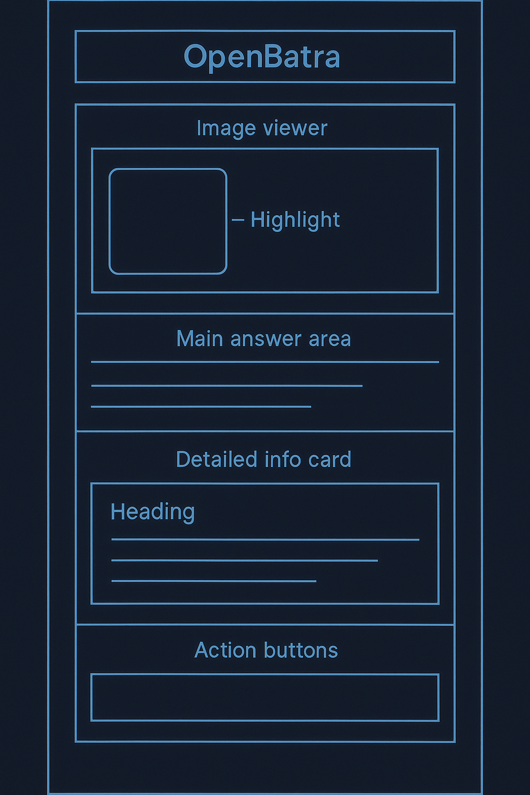

# Conception de l'IA et de l'Interface

**[◀ Retour au README Principal](../../README.md)**

Ce document est la synthèse de la conception de l'expérience utilisateur (UI) et de l'intelligence artificielle (IA) d'OpenBatra. Il définit l'apparence de l'interface, les structures de données qui la nourrissent, et les prompts qui pilotent le modèle Gemma 3n.

---

## 1. Mockup Textuel de l'Interface Utilisateur (UI)

Ce mockup décrit la disposition et les éléments de l'écran principal après une analyse réussie. Il sert de guide pour le développement front-end et l'audit d'accessibilité.

<p align="center">
  
</p>

### Mockup: Écran de Résultat d'Analyse

**Contexte :** Le side panel affiche ce résultat après que l'utilisateur a posé la question "Y a-t-il des noix ?" et que l'IA a terminé son analyse.

---

#### **1. Visionneuse d'Image** (`div` avec `role="img"`)
-   **`aria-label` :** "Image du produit analysé. L'expression 'traces de fruits à coque' est surlignée en rouge dans la liste des ingrédients."
-   **Contenu Visuel :**
    -   Affiche la photo du produit prise par l'utilisateur.
    -   Un `<canvas>` est superposé, dessinant un rectangle rouge semi-transparent précisément autour de la zone de texte détectée (`boundingBox`).

#### **2. Réponse Principale** (`h2`)
-   **Attributs :** `aria-live="assertive"` (pour une annonce immédiate par les lecteurs d'écran).
-   **Style :** Police de grande taille, en gras, centrée.
-   **Texte :** Affiche le contenu du champ `humanReadableAnswer` de l'objet `AnalysisResult`.
-   **Exemple :** "Oui, des fruits à coque sont mentionnés."

#### **3. Carte d'Information Détaillée** (`div` avec un bord, style "card")
-   **`aria-label` :** "Détails de la détection."
-   **Contenu :** Une liste de paires clé/valeur basées sur le résultat.
    -   **Ingrédient Détecté :** Affiche `foundTerm`. (Ex: `traces de fruits à coque`)
    -   **Extrait du Contexte :** Affiche `contextSnippet`. (Ex: "...farine de blé, sucre, beurre, traces de fruits à coque, sel...")
    -   **Confiance de l'IA :** Affiche `confidenceScore` formaté en pourcentage. (Ex: 97%)

#### **4. Section Actions** (`div`)
-   **`aria-label` :** "Actions de suivi."
-   **Contenu :** Des boutons clairs et accessibles.
    -   **Bouton 1 :** "Autre Question" (`aria-label` : "Poser une autre question sur ce même produit.")
    -   **Bouton 2 :** "Nouveau Produit" (`aria-label` : "Analyser un nouveau produit.")

---

## 2. Modélisation des Données

La fiabilité du système repose sur des contrats de données (schemas) clairs entre les composants.
**[▸ Voir les détails complets des modèles de données](architecture/Data_Models.md)**

### Schéma `AnalysisResult` (JSON Schema)

Cet objet est le livrable de l'Agent `Socrates`. Il est produit par le service IA et consommé par l'AppController et l'UI.

<details>
  <summary>Cliquez pour voir le schéma JSON complet pour `AnalysisResult`</summary>
  
  ```json
  {
    "$schema": "http://json-schema.org/draft-07/schema#",
    "title": "AnalysisResult",
    "description": "Objet de données structuré retourné par l'AI_Service après l'analyse d'un produit.",
    "type": "object",
    "properties": {
      "humanReadableAnswer": {
        "description": "La réponse directe et naturelle à la question de l'utilisateur.",
        "type": "string"
      },
      "foundTerm": {
        "description": "Le terme exact ou l'entité qui a été trouvé dans le texte.",
        "type": "string"
      },
      "contextSnippet": {
        "description": "Un court extrait du texte original montrant le terme trouvé dans son contexte.",
        "type": "string"
      },
      "confidenceScore": {
        "description": "Le score de confiance de l'IA pour cette détection, entre 0 et 1.",
        "type": "number",
        "minimum": 0,
        "maximum": 1
      },
      "boundingBox": {
        "description": "Les coordonnées normalisées (0-1) du rectangle entourant le terme trouvé sur l'image.",
        "type": "object",
        "properties": {
          "x": { "type": "number" },
          "y": { "type": "number" },
          "width": { "type": "number" },
          "height": { "type": "number" }
        },
        "required": ["x", "y", "width", "height"]
      }
    },
    "required": ["humanReadableAnswer", "foundTerm", "confidenceScore", "boundingBox"]
  }

</details>

Schéma UserPreference (JSON Schema)

Cet objet est la structure utilisée pour sauvegarder les préférences de l'utilisateur dans IndexedDB.

<details>
<summary>Cliquez pour voir le schéma JSON complet pour `UserPreference`</summary>

Generated json
{
  "$schema": "http://json-schema.org/draft-07/schema#",
  "title": "UserPreference",
  "description": "Objet de données représentant une préférence utilisateur à stocker dans IndexedDB.",
  "type": "object",
  "properties": {
    "preferenceId": {
      "description": "Identifiant unique de la préférence.",
      "type": "string",
      "format": "uuid"
    },
    "preferenceType": {
      "description": "Le type de préférence.",
      "type": "string",
      "enum": ["allergy", "diet", "intolerance", "other"]
    },
    "value": {
      "description": "La valeur de la préférence (ex: 'nuts', 'gluten-free', 'lactose').",
      "type": "string"
    },
    "createdAt": {
      "description": "Timestamp de la création de la préférence.",
      "type": "string",
      "format": "date-time"
    }
  },
  "required": ["preferenceId", "preferenceType", "value", "createdAt"]
}
IGNORE_WHEN_COPYING_START
content_copy
download
Use code with caution.
Json
IGNORE_WHEN_COPYING_END
</details>

3. Le Livre de Prompts Maître

Les prompts sont le cœur de notre IA. Ils sont soigneusement conçus pour être fiables, efficaces et pour contraindre la sortie du modèle au format désiré.
▸ Voir les détails complets des prompts

Prompt Maître 1 : analyzeProduct

Objectif : Analyser une image et une question pour générer un AnalysisResult JSON valide.

Technique Clé : Instruction explicite de suivre un schéma JSON, fournie directement dans le prompt.

<details>
<summary>Cliquez pour voir le prompt maître `analyzeProduct`</summary>

Generated text
You are an expert multimodal AI assistant named "Lens". Your task is to meticulously analyze the provided image and answer the user's question.

You MUST respond ONLY with a single, valid JSON object that strictly adheres to the following JSON Schema. Do not add any conversational text or explanations. 

### JSON Schema to Follow:
{
  "$schema": "http://json-schema.org/draft-07/schema#",
  "title": "AnalysisResult",
  "type": "object",
  "properties": { /* ... (schema properties as defined above) ... */ },
  "required": ["humanReadableAnswer", "foundTerm", "confidenceScore", "boundingBox"]
}

--- INPUT ---
Image: {{image}}
User's Question: {{user_question}}
IGNORE_WHEN_COPYING_START
content_copy
download
Use code with caution.
Text
IGNORE_WHEN_COPYING_END
</details>

Prompt Maître 2 : proposeMemoization

Objectif : Analyser une interaction pour décider s'il faut proposer de mémoriser une préférence.

Technique Clé : Analyse sémantique de la question de l'utilisateur pour détecter des mots-clés liés à des contraintes personnelles.

<details>
<summary>Cliquez pour voir le prompt maître `proposeMemoization`</summary>

Generated text
You are an empathetic conversational AI assistant named "Orion". Your task is to analyze the following user interaction data and decide if it is appropriate to proactively offer to remember a user's preference.

Analyze the user's original question within the provided JSON input. Your goal is to infer if the question reveals a long-term personal constraint such as a health condition, diet, or strong preference. 

- IF the user's question contains keywords that imply such a constraint (e.g., "allergic", "allergy", "intolerant", "celiac", "diet", "régime", "vegan", "avoid"), THEN you should propose to remember it.
- ELSE, you should not propose anything.

You MUST respond ONLY with a single, valid JSON object with the following structure:
{
  "shouldPropose": boolean,
  "proposalText": "Your generated text or an empty string"
}

--- INPUT ---
User Interaction Data: {{analysis_result_json}}
