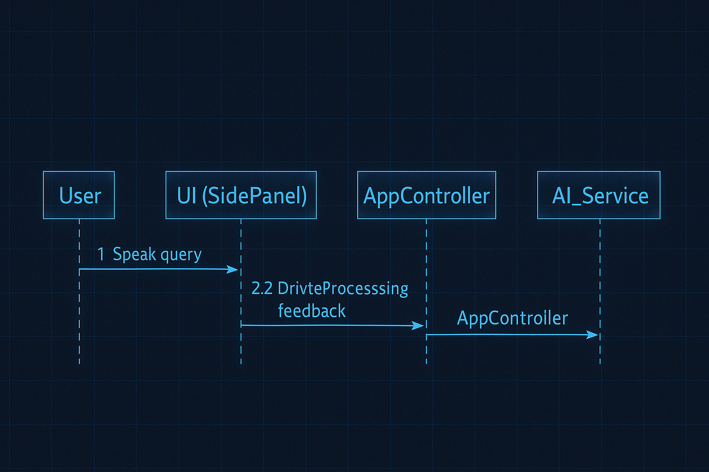
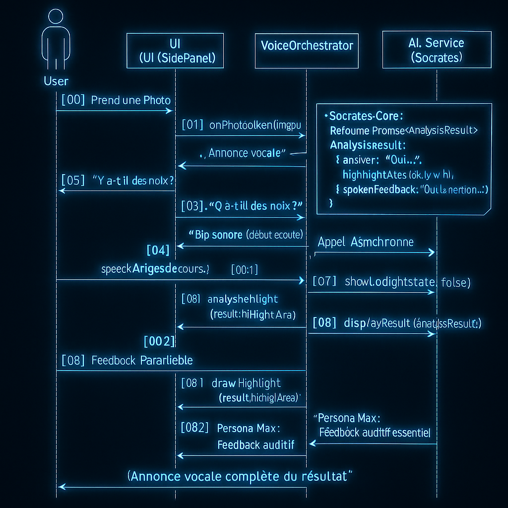

# Architecture Détaillée : Le Diagramme de Séquence

**[◀ Retour au README Principal](../../README.md)**

Ce document fournit une vue architecturale détaillée de l'interaction la plus critique du projet OpenBatra : le flux de dialogue pour "Identifier un Élément". Il illustre, étape par étape, la cascade d'appels de fonction et d'échanges de données entre les composants clés de notre système.

Ce diagramme est la traduction technique du **Scénario Nominal** décrit dans le **[Cas d'Utilisation UC1](use-cases/UC1_Create_Identity.md)**.

---

## 1. Composants Système (Lifelines)

Notre architecture est découpée en cinq composants logiques principaux qui collaborent pour créer l'expérience utilisateur.

| Composant | Rôle | Technologies Clés |
| :--- | :--- | :--- |
| **User** | L'acteur humain qui initie les actions et reçoit les feedbacks. | - |
| **UI (SidePanel)** | La couche de présentation. Elle affiche l'information, capture les événements (clics) et est responsable du rendu visuel. | HTML, CSS, JavaScript (Framework UI) |
| **VoiceOrchestrator** | Le module dédié à la gestion des interactions vocales. Il encapsule la complexité des API du navigateur. | `Web Speech API` (`SpeechRecognition`, `SpeechSynthesis`) |
| **AppController** | Le cerveau logique de l'application. Il est le chef d'orchestre qui reçoit les intentions et commande les autres composants. Il ne gère pas directement le DOM ou les API. | JavaScript/TypeScript |
| **AI_Service** | Le service qui encapsule toute la logique d'interaction avec le modèle Gemma 3n. Il prépare les prompts et traite les résultats. | `Transformers.js`, `Gemma 3n` |

<p align="center">
  
</p>

---

## 2. Diagramme de Séquence UML

Ce diagramme illustre la séquence complète, de la prise de photo par l'utilisateur à la réponse multimodale du système.

<p align="center">
  
</p>

```plantuml
@startuml
autonumber "<b>[00]"

actor User
participant "UI (SidePanel)" as UI
participant "VoiceOrchestrator" as VO
participant "AppController" as CTRL
participant "AI_Service (Socrates)" as AIS

skinparam sequenceMessageAlign center

User -> UI: Prend une Photo
UI -> CTRL: onPhotoTaken(imageData)
CTRL -> UI: requestUserQuestion()

UI -> VO: promptAndListen("Quelle est votre question ?")
VO --> User: *Annonce vocale*
VO ->> User: *Bip sonore (début écoute)*

User ->> VO: "Y a-t-il des noix ?"
VO -> CTRL: onQuestionReceived(questionText)
CTRL -> UI: showLoadingState(true)
UI -> VO: speak("Analyse en cours...")

par Appel Asynchrone
    CTRL -> AIS: analyzeProduct(imageData, questionText)
    note right of AIS
      **Socrates-Core:**
      Retourne Promise<AnalysisResult>
      AnalysisResult: {
        answer: "Oui...",
        highlightArea: {x,y,w,h},
        spokenFeedback: "Oui, la mention..."
      }
    end note
    AIS --> CTRL: Promise.resolve(analysisResult)
end

CTRL -> UI: showLoadingState(false)
CTRL -> UI: displayResult(analysisResult)

par Feedback Parallèle
    UI -> UI: drawHighlight(result.highlightArea)
    note left: **Forge-Web:** Met à jour le <canvas>
    
    UI -> VO: speak(result.spokenFeedback)
    note right: **Persona-Max:** Feedback auditif essentiel
end

VO --> User: *Annonce vocale complète du résultat*

@enduml

3. Description Détaillée du Flux
Phase 1 : Capture de la Demande (Messages 1-8)

[User → UI] : Prend une Photo
L'utilisateur initie le processus en capturant une image du produit via l'interface du side panel.

[UI → AppController] : onPhotoTaken(imageData)
L'UI notifie l'AppController qu'une photo a été prise, en lui transmettant les données brutes de l'image.

[AppController → UI] : requestUserQuestion()
L'AppController instruit l'UI de passer à l'étape suivante : obtenir la question de l'utilisateur.

[UI → VoiceOrchestrator] : promptAndListen(...)
L'UI délègue la gestion de l'interaction vocale au VoiceOrchestrator, lui demandant de poser la question "Quelle est votre question ?".

[VoiceOrchestrator → User] : Annonce vocale
Le VoiceOrchestrator utilise la SpeechSynthesis API pour poser la question à l'utilisateur.

[VoiceOrchestrator → User] : Bip sonore (début écoute)
Immédiatement après, il émet un signal sonore clair pour indiquer que le système est en mode écoute via la SpeechRecognition API.

[User → VoiceOrchestrator] : "Y a-t-il des noix ?"
L'utilisateur pose sa question.

[VoiceOrchestrator → AppController] : onQuestionReceived(questionText)
Une fois la reconnaissance vocale terminée, le VoiceOrchestrator transmet le texte transcrit à l'AppController.

Phase 2 : Analyse IA (Messages 9-13)

[AppController → UI] : showLoadingState(true)
L'AppController demande à l'UI d'afficher un indicateur de chargement (ex: spinner).

[UI → VoiceOrchestrator] : speak("Analyse en cours...")
Pour garantir l'accessibilité, l'UI demande immédiatement une confirmation vocale de l'état de chargement.

[Appel Asynchrone] Le traitement IA est lancé de manière non bloquante pour ne pas geler l'interface.

[AppController → AI_Service] : analyzeProduct(...)
L'AppController, possédant maintenant l'image et la question, appelle l'AI_Service pour lancer l'analyse multimodale avec Gemma 3n. Le retour est une Promise.

[AI_Service → AppController] : Promise.resolve(analysisResult)
Une fois l'analyse terminée, l'AI_Service résout la promesse avec un objet AnalysisResult structuré. Voir le schéma de données détaillé »

Phase 3 : Restitution du Résultat (Messages 14-19)

[AppController → UI] : showLoadingState(false)
L'AppController demande à l'UI de masquer l'indicateur de chargement.

[AppController → UI] : displayResult(analysisResult)
L'AppController envoie l'objet de résultat complet à l'UI pour affichage.

[Feedback Parallèle] L'UI traite le résultat et fournit un feedback visuel et auditif simultanément pour une expérience riche et accessible.

[UI → UI] : drawHighlight(...)
L'UI utilise les coordonnées de highlightArea pour dessiner un surlignage sur l'image du produit dans un élément <canvas>.

[UI → VoiceOrchestrator] : speak(...)
L'UI envoie le champ spokenFeedback de l'objet de résultat au VoiceOrchestrator pour une annonce claire et descriptive.

[VoiceOrchestrator → User] : Annonce vocale complète du résultat
Le VoiceOrchestrator synthétise le texte et le présente à l'utilisateur, complétant ainsi la boucle d'interaction.

