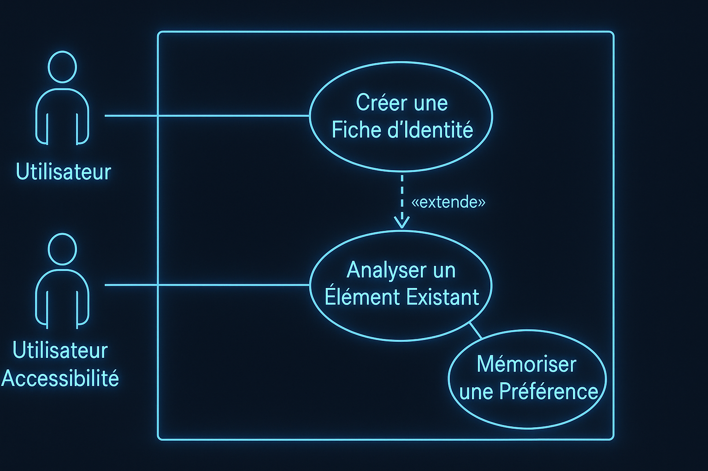
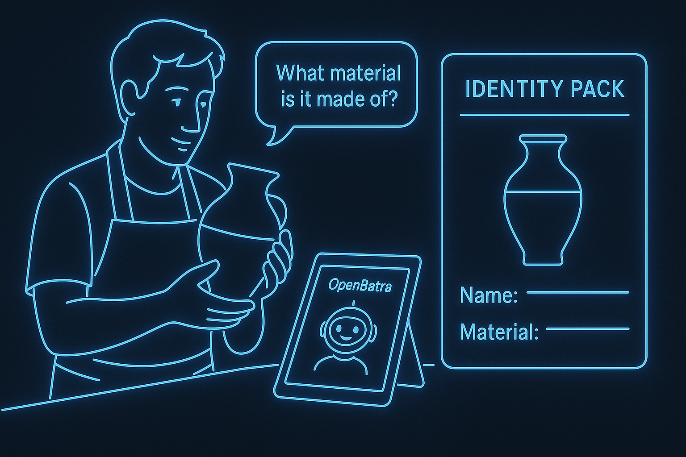
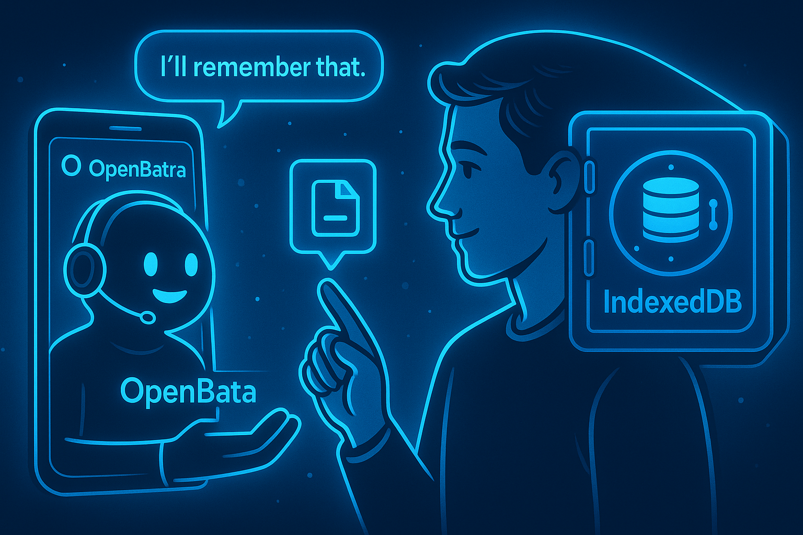

# Analyse Fonctionnelle : Les Cas d'Utilisation (UML)

Ce document détaille les exigences fonctionnelles du projet OpenBatra à travers le prisme des Cas d'Utilisation (Use Cases) UML. Il décrit les interactions entre les utilisateurs (Acteurs) et le système pour atteindre des objectifs spécifiques.

---

## Acteurs du Système

Nos personas principaux ont été modélisés en deux acteurs distincts pour garantir que toutes les fonctionnalités, en particulier celles liées à l'accessibilité, sont prises en compte dès la conception.

| Acteur | Description | Illustration |
| :--- | :--- | :--- |
| **Utilisateur** | Représente toute personne, marchand ou non, interagissant avec le système. Il peut être un **Consommateur** qui cherche à comprendre un élément, ou un **Créateur** qui cherche à définir l'identité d'un bien ou d'un service. |  |
| **Utilisateur Accessibilité** | Représente un utilisateur ayant des besoins spécifiques (ex: malvoyant) qui dépend principalement de l'interface vocale (TTS/STT) pour toutes les interactions, que ce soit pour comprendre ou pour créer. |  |

---

## Vue d'Ensemble des Cas d'Utilisation

Le diagramme suivant présente la vue d'ensemble des principales fonctionnalités. Le cœur du système est la capacité de créer une fiche d'identité, qui peut s'appuyer sur une analyse préalable.

  > relationship with another use case named 'Analyser un Élément Existant'. A separate use case, 'Mémoriser une Préférence', is also present. The style is 'Blue-Glow Infographic': clean, professional, and easy to read. --ar 16:9">

---

## Détail des Cas d'Utilisation

Chaque cas d'utilisation est détaillé dans un document séparé pour une analyse approfondie.

### 1. Créer une Fiche d'Identité

**C'est le cœur absolu du projet.** Cette fonctionnalité permet à n'importe quel acteur (artisan, consultant, scientifique, particulier...) de définir de manière structurée l'identité d'un bien ou d'un service. L'utilisateur est guidé par l'IA dans un dialogue pour construire cette fiche. Pour accélérer le processus, il peut démarrer par une analyse d'un élément existant (photo, document).

- **Objectif :** Créer un "Pack d'Identité" numérique complet, structuré et partageable pour n'importe quel élément.
- **Acteurs :** Utilisateur, Utilisateur Accessibilité.
- **Lien vers l'analyse détaillée :** **[Consulter les détails de UC1 : Créer une Fiche d'Identité »](use-cases/UC1_Create_Identity.md)**

  

### 2. Mémoriser une Préférence

Cette fonctionnalité transforme OpenBatra d'un simple outil à un véritable compagnon intelligent. En mémorisant les préférences de l'utilisateur (allergies, centres d'intérêt, langue de travail), l'IA peut fournir des réponses et des suggestions proactives et personnalisées.

- **Objectif :** Personnaliser l'expérience en sauvegardant les préférences de l'utilisateur de manière privée et locale.
- **Acteurs :** Utilisateur, Utilisateur Accessibilité.
- **Lien vers l'analyse détaillée :** **[Consulter les détails de UC2 : Mémoriser une Préférence »](use-cases/UC2_Memorize_Preference.md)**

  

