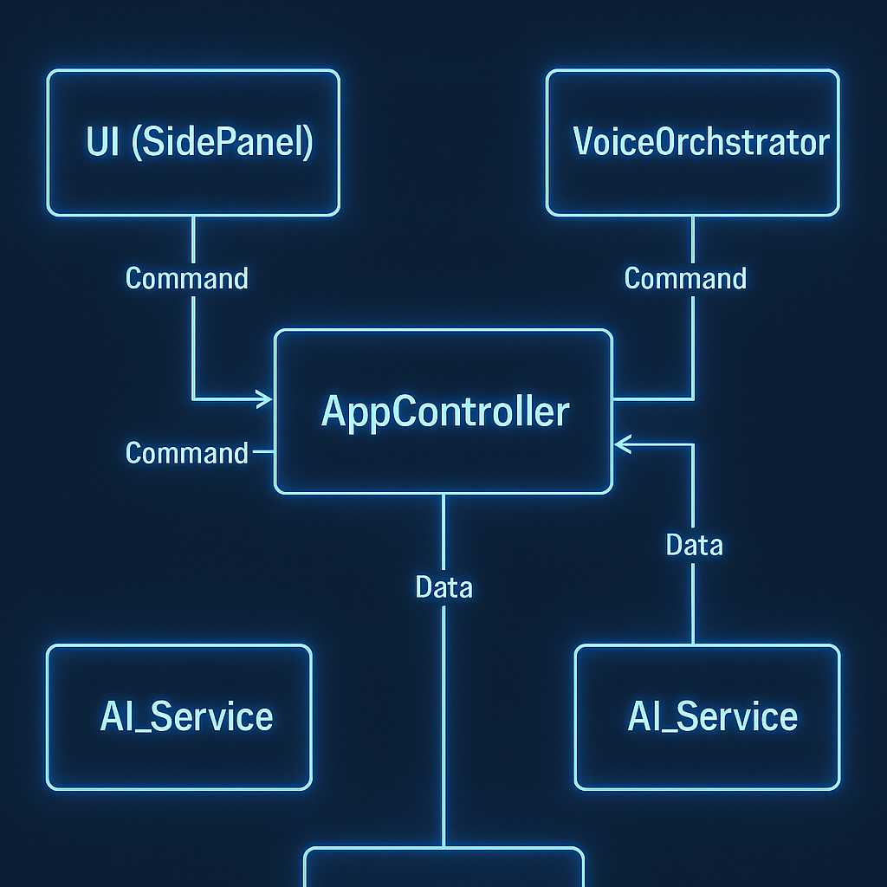

# Architecture : Description des Composants

**[◀ Retour à l'Analyse d'Architecture Principale](../SEQUENCE_DIAGRAM.md)**

Ce document décrit en détail le rôle, les responsabilités et les technologies de chacun des cinq composants (ou "lifelines") identifiés dans notre diagramme de séquence. Comprendre la séparation des préoccupations entre ces modules est la clé pour maintenir un code propre, testable et évolutif.

---

## Vue d'Ensemble de l'Architecture

Notre architecture est conçue pour être modulaire et résiliente. Chaque composant a un rôle clairement défini, ce qui facilite le développement, le débogage et les futures améliorations.

  

---

## 1. UI (SidePanel)

-   **Rôle :** Couche de Présentation ("La Vue").
-   **Responsabilités :**
    -   Afficher l'état actuel de l'application à l'utilisateur.
    -   Capturer les interactions de l'utilisateur (clics, soumission de formulaires, téléversement de fichiers).
    -   Traduire les données brutes (ex: `AnalysisResult`) en éléments graphiques (surlignages sur le `<canvas>`, cartes d'information).
    -   Déléguer la logique métier et les interactions complexes à l'AppController et au VoiceOrchestrator.
    -   Ne contient **aucune logique métier** complexe. Il est "stupide" et ne fait qu'obéir aux ordres du contrôleur.
-   **Technologies Clés :**
    -   HTML5, CSS3, JavaScript/TypeScript.
    -   Un framework réactif (ex: React, Svelte, Vue.js) pour gérer efficacement l'état de l'interface.
    -   `Canvas API` pour le surlignage dynamique sur les images.

---

## 2. VoiceOrchestrator (Agent "Orion")

-   **Rôle :** Interface Conversationnelle ("La Voix").
-   **Responsabilités :**
    -   Encapsuler toute la complexité de la **Web Speech API**.
    -   Gérer le cycle de vie de la reconnaissance vocale (`SpeechRecognition`) : démarrer, arrêter, traiter les résultats, gérer les erreurs.
    -   Gérer la file d'attente et la lecture des annonces vocales (`SpeechSynthesis`).
    -   Fournir une interface simple au reste de l'application (ex: `promptAndListen()`, `speak()`).
    -   Convertir les transcriptions brutes en intentions claires pour l'AppController.
-   **Technologies Clés :**
    -   `window.SpeechRecognition` pour la conversion de la parole en texte (STT).
    -   `window.SpeechSynthesis` pour la conversion du texte en parole (TTS).

---

## 3. AppController

-   **Rôle :** Chef d'Orchestre ("Le Cerveau Logique").
-   **Responsabilités :**
    -   Centraliser la logique métier de l'application.
    -   Recevoir les événements de l'UI et du VoiceOrchestrator (ex: `onPhotoTaken`, `onQuestionReceived`).
    -   Maintenir l'état global de la session en cours.
    -   Commander les autres services : demander à l'IA d'analyser, demander à l'UI d'afficher un résultat, demander au VoiceOrchestrator de parler.
    -   Gérer la séquence des opérations (ex: d'abord obtenir l'image, puis la question, puis lancer l'analyse).
-   **Technologies Clés :**
    -   JavaScript/TypeScript pur (sans dépendance directe au DOM).

---

## 4. AI_Service (Agent "Socrates" & "Lens")

-   **Rôle :** Service d'Intelligence Artificielle ("L'Expert").
-   **Responsabilités :**
    -   Être le seul point de contact avec le modèle **Gemma 3n**.
    -   Préparer et formater les prompts (ex: `analyzeProduct`) en y injectant les données d'entrée (image, question).
    -   Exécuter l'inférence sur le modèle via la librairie `Transformers.js`.
    -   Gérer la contrainte de schéma pour forcer une sortie JSON.
    -   Parser et valider la réponse JSON du modèle avant de la retourner à l'AppController.
    -   Retourner des `Promise` pour gérer les opérations asynchrones d'inférence.
-   **Technologies Clés :**
    -   `Transformers.js` (ou une autre librairie d'inférence web).
    -   Connaissance intime des prompts et des schémas de données.

---

## 5. DataStore (Agent "Forge")

Bien qu'il n'apparaisse pas comme une lifeline distincte dans notre séquence principale *d'analyse*, ce composant est fondamental pour la persistance des données, notamment dans les cas d'utilisation `Mémoriser une Préférence` et la sauvegarde des sessions de `Créer une Fiche d'Identité`.

-   **Rôle :** Service de Persistance ("La Mémoire").
-   **Responsabilités :**
    -   Encapsuler toutes les interactions avec le stockage local du navigateur.
    -   Fournir des méthodes simples pour lire, écrire, mettre à jour et supprimer des données (ex: `savePreference(pref)`, `getPreferences()`).
    -   Gérer la création et la migration des schémas de la base de données locale.
-   **Technologies Clés :**
    -   `IndexedDB API` pour un stockage structuré et robuste.
    -   (Optionnel) `Cache API` avec les `Service Workers` pour le mode offline complet de l'application.