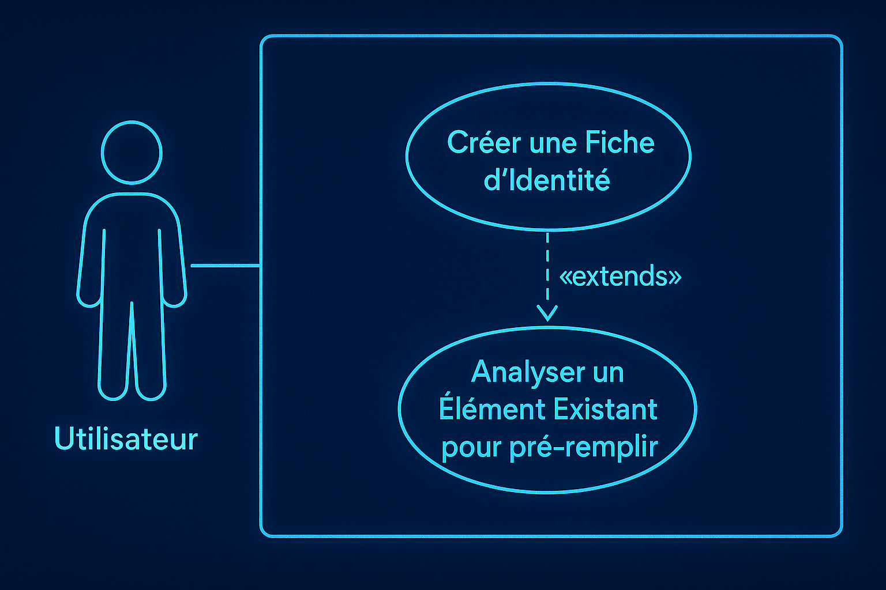

# UC1: Créer une Fiche d'Identité

**[◀ Retour à la Vue d'Ensemble des Cas d'Utilisation](../USE_CASES.md)**

Ce document fournit une analyse détaillée du cas d'utilisation principal du projet OpenBatra : la création d'une fiche d'identité numérique pour tout bien, service ou concept.

---

## 1. Description et Objectif

C'est la fonctionnalité centrale d'OpenBatra. Elle permet à n'importe quel utilisateur (un artisan, un consultant, un scientifique, un organisateur d'événement, etc.) de définir l'identité d'un élément de manière structurée. Le processus est un dialogue guidé par l'IA (Agent Orion), qui pose des questions pertinentes pour construire une fiche complète. L'utilisateur peut commencer de zéro ou accélérer le processus en analysant un élément existant (une photo, un document, une ébauche de texte).

Le livrable final est un **"Pack d'Identité"** : un fichier `.zip` autonome contenant les données structurées (JSON), les images, et un micro-site web de présentation.

  

## 2. Diagramme UML du Cas d'Utilisation

Le diagramme montre que l'analyse d'un élément existant est une extension optionnelle (`<<extends>>`) du processus de création principal.

  > relationship to another use case named 'Analyser un Élément Existant pour pré-remplir'. The actor 'Utilisateur' is connected to the main creation use case. The style is 'Blue-Glow Infographic'. --ar 16:9">

## 3. Informations Détaillées

| Champ | Description |
| :--- | :--- |
| **ID** | UC1 |
| **Nom** | Créer une Fiche d'Identité |
| **Acteurs** | `Utilisateur`, `Utilisateur Accessibilité` |
| **Déclencheur** | L'utilisateur exprime l'intention de créer une nouvelle fiche d'identité. |
| **Préconditions** | L'extension OpenBatra est active. |
| **Postconditions (Succès)** | Un "Pack d'Identité" `.zip` a été généré et proposé à l'utilisateur pour sauvegarde. La session de création est enregistrée localement. |
| **Postconditions (Échec)** | Le système a notifié l'utilisateur de l'échec et a sauvegardé la session de travail en l'état. |

## 4. Scénario Nominal (Création Guidée de Zéro)

Cette séquence décrit le flux de création sans analyse préalable.

1.  **Utilisateur :** Active l'agent et dit "Je veux créer une nouvelle fiche d'identité".
2.  **Système (Agent Orion) :** "Parfait. Commençons. Quel est le nom de l'élément que vous souhaitez décrire ?"
    - *API :* `SpeechSynthesis`
3.  **Utilisateur :** "Service de Conseil en Stratégie Digitale".
    - *API :* `SpeechRecognition`
4.  **Système (Agent Orion) :** "Noté. Maintenant, décrivez-moi brièvement ce service en une ou deux phrases."
5.  **Dialogue Itératif :** L'utilisateur et l'IA continuent ce dialogue. L'IA pose des questions ciblées pour remplir les champs de la fiche d'identité (public cible, livrables, prix, durée, etc.). L'utilisateur peut aussi téléverser des images (`<input type="file">`) lorsque l'IA le propose.
6.  **Système (Agent Socrates) :** En arrière-plan, l'IA structure les réponses de l'utilisateur dans un objet JSON.
7.  **Utilisateur :** "C'est bon pour moi, génère la fiche."
8.  **Système (Agent Forge) :**
    a. L'agent Forge prend l'objet JSON finalisé et les images.
    b. Il génère un micro-site HTML/CSS simple.
    c. Il compile le tout dans un fichier `.zip` en mémoire.
    - *Librairie :* `JSZip`
9.  **Système (UI) :** Le système propose à l'utilisateur de sauvegarder le fichier.
    - *API :* `File System Access API`
10. **Système (Agent Spore) :** Optionnellement, l'utilisateur peut demander la création d'un lien de partage.
    - *Librairie :* `WebTorrent`

## 5. Scénario Étendu (Création assistée par Analyse)

Cette séquence montre comment l'utilisateur peut accélérer le processus.

1.  **Utilisateur :** Active l'agent et dit "Je veux créer une fiche à partir de cette photo de ma poterie". Il prend une photo.
2.  **Système (Point d'extension `<<extends>>`) :** Le système exécute une analyse générale de l'image.
3.  **Système (Agent Lens/Socrates) :** Gemma 3n analyse l'image de la poterie. Il identifie la forme, la couleur dominante, et peut-être du texte sur une étiquette. Il pré-remplit les champs : `Type: Poterie`, `Couleur: Terre cuite`, `Matériau suspecté: Argile`.
4.  **Système (Agent Orion) :** "Intéressant. J'ai commencé à remplir la fiche. D'après la photo, il s'agit d'une poterie en terre cuite. Est-ce correct ?"
5.  **Utilisateur :** "Oui, c'est exact."
6.  **Dialogue Itératif :** Le flux rejoint le scénario nominal à l'étape 5. Le dialogue se poursuit pour compléter les informations manquantes (prix, dimensions, histoire de la pièce...).

## 6. Flux Alternatifs

### 6.1. Interruption de la Session

- **Déclencheur :** L'utilisateur ferme le navigateur ou le side panel au milieu d'une session de création.
- **Flux :**
    1. L'état actuel de la fiche d'identité en cours de création est automatiquement sauvegardé dans **IndexedDB** à chaque étape.
    2. Au prochain lancement, l'Agent Orion détecte la session inachevée.
    3. **Orion :** "Bonjour. Il semble que nous n'ayons pas terminé de créer la fiche pour 'Service de Conseil en Stratégie Digitale'. Voulez-vous reprendre là où nous nous sommes arrêtés ?"

### 6.2. Donnée Ambiguë

- **Déclencheur :** L'utilisateur donne une réponse que l'IA ne peut pas facilement structurer (ex: pour le prix, il répond "Ça dépend").
- **Flux :**
    1. L'Agent Socrates signale une ambiguïté.
    2. L'Agent Orion pose une question de clarification.
    3. **Orion :** "Je comprends. Pour la fiche, pourriez-vous me donner une fourchette de prix, par exemple 'de 50 à 150 euros' ? Ou préférez-vous indiquer 'Prix sur devis' ?"