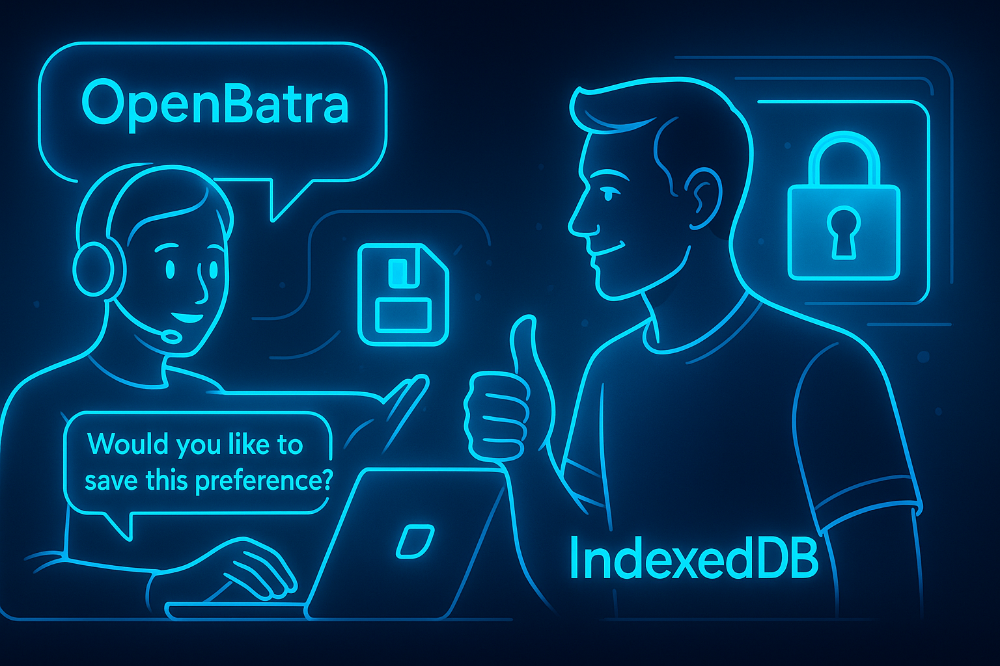

# UC2: Mémoriser une Préférence

**[◀ Retour à la Vue d'Ensemble des Cas d'Utilisation](../USE_CASES.md)**

Ce document fournit une analyse détaillée du cas d'utilisation qui transforme OpenBatra d'un outil transactionnel en un véritable compagnon personnalisé.

---

## 1. Description et Objectif

Cette fonctionnalité permet au système d'apprendre des interactions de l'utilisateur pour personnaliser les futures sessions. En se souvenant des préférences clés (comme les allergies, les régimes alimentaires, la langue de travail préférée, ou des sujets d'intérêt récurrents), l'IA peut fournir des analyses plus pertinentes, des suggestions proactives, et un dialogue plus fluide.

Toutes les préférences sont stockées **exclusivement en local** sur l'appareil de l'utilisateur via `IndexedDB`, garantissant une confidentialité absolue.

  

## 2. Diagramme UML du Cas d'Utilisation

  > sub-tasks like 'Détecter une préférence potentielle', 'Proposer la sauvegarde', 'Confirmer vocalement', and 'Gérer les préférences existantes'. The style is 'Blue-Glow Infographic'. --ar 16:9">

## 3. Informations Détaillées

| Champ | Description |
| :--- | :--- |
| **ID** | UC2 |
| **Nom** | Mémoriser une Préférence |
| **Acteurs** | `Utilisateur`, `Utilisateur Accessibilité` |
| **Déclencheur** | Le système détecte une préférence potentielle dans le dialogue, ou l'utilisateur exprime explicitement le désir de sauvegarder une préférence. |
| **Préconditions** | Une session est active. L'API IndexedDB est disponible dans le navigateur. |
| **Postconditions (Succès)** | Une nouvelle préférence a été ajoutée ou une préférence existante a été modifiée/supprimée dans la base de données locale. Le système a confirmé l'action à l'utilisateur. |
| **Postconditions (Échec)** | Le système a notifié l'utilisateur de l'échec de la sauvegarde et n'a pas modifié les préférences. |

## 4. Scénario Nominal (Détection Proactive)

Cette séquence décrit le flux où l'IA propose intelligemment de sauvegarder une information.

1.  **Contexte :** L'utilisateur est en train d'analyser une étiquette alimentaire.
2.  **Utilisateur :** "Vérifie ce produit, je suis très allergique aux arachides."
3.  **Système (Agent Socrates) :** Pendant qu'il traite la demande d'analyse, l'agent exécute en parallèle le prompt `proposeMemoization`. Le prompt détecte les mots-clés "allergique" et "arachides".
    - *IA :* C'est ici que le prompt `proposeMemoization` est exécuté.
4.  **Système (Agent Orion) :** D'abord, il fournit le résultat de l'analyse principale (UC1).
    - **Orion :** "Ce produit ne contient aucune mention d'arachides."
5.  **Système (Agent Orion) :** Immédiatement après, il enchaîne avec la proposition de mémorisation.
    - **Orion :** "J'ai noté que vous mentionnez une allergie aux arachides. Voulez-vous que je m'en souvienne pour vous alerter automatiquement à l'avenir ?"
    - *API :* `SpeechSynthesis`
6.  **Utilisateur :** "Oui, excellente idée."
    - *API :* `SpeechRecognition`
7.  **Système :** L'AppController reçoit la confirmation et crée un objet `UserPreference`.
8.  **Système (Agent Forge) :** L'objet est sauvegardé dans la base de données locale.
    - *API :* `IndexedDB`
9.  **Système (Agent Orion) :** L'IA confirme la sauvegarde.
    - **Orion :** "C'est enregistré. Je serai vigilant pour vous. Vous pouvez gérer vos préférences à tout moment en disant 'Mes réglages'."

## 5. Scénario Alternatif (Gestion Manuelle)

Cette séquence décrit comment l'utilisateur peut gérer ses préférences de manière explicite.

1.  **Utilisateur :** "Orion, montre-moi mes réglages."
2.  **Système (UI) :** L'interface affiche une vue dédiée à la gestion des préférences, listant toutes les préférences sauvegardées.
3.  **Système (Agent Orion) :** L'IA lit la liste des préférences à voix haute.
    - **Orion :** "Vous avez une préférence enregistrée : Allergie aux arachides. Vous pouvez dire 'supprimer l'allergie aux arachides' ou 'ajouter une préférence'."
4.  **Utilisateur :** "Ajoute une préférence. Régime végétalien."
5.  **Système :** Le système suit un mini-dialogue pour confirmer et sauvegarder la nouvelle préférence, rejoignant le flux nominal à l'étape 7.

## 6. Flux d'Erreur

### 6.1. Échec de la Sauvegarde

- **Déclencheur :** L'API `IndexedDB` retourne une erreur (ex: espace de stockage plein, base de données corrompue).
- **Flux :**
    1. L'AppController intercepte l'erreur.
    2. L'Agent Orion notifie l'utilisateur.
    3. **Orion :** "Désolé, une erreur technique m'empêche de sauvegarder votre préférence pour le moment. Nous pourrons réessayer plus tard."