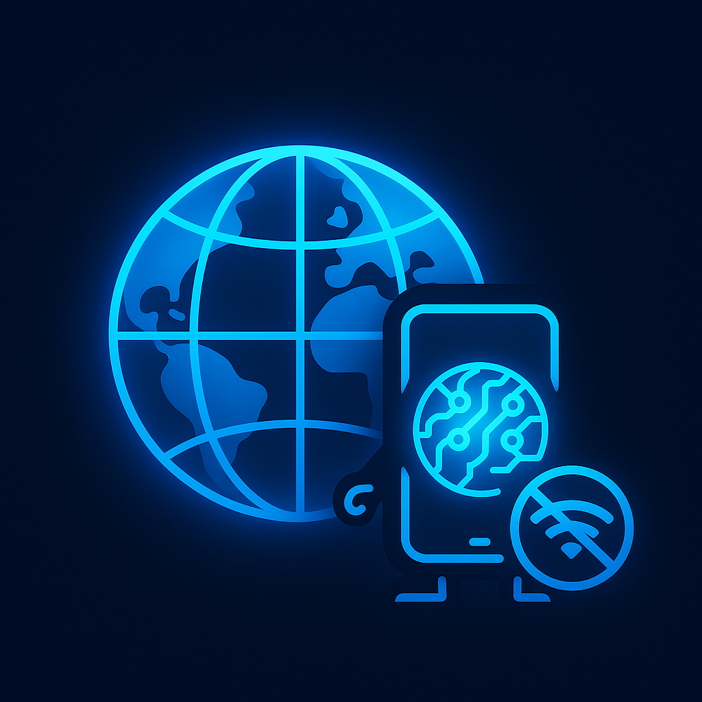
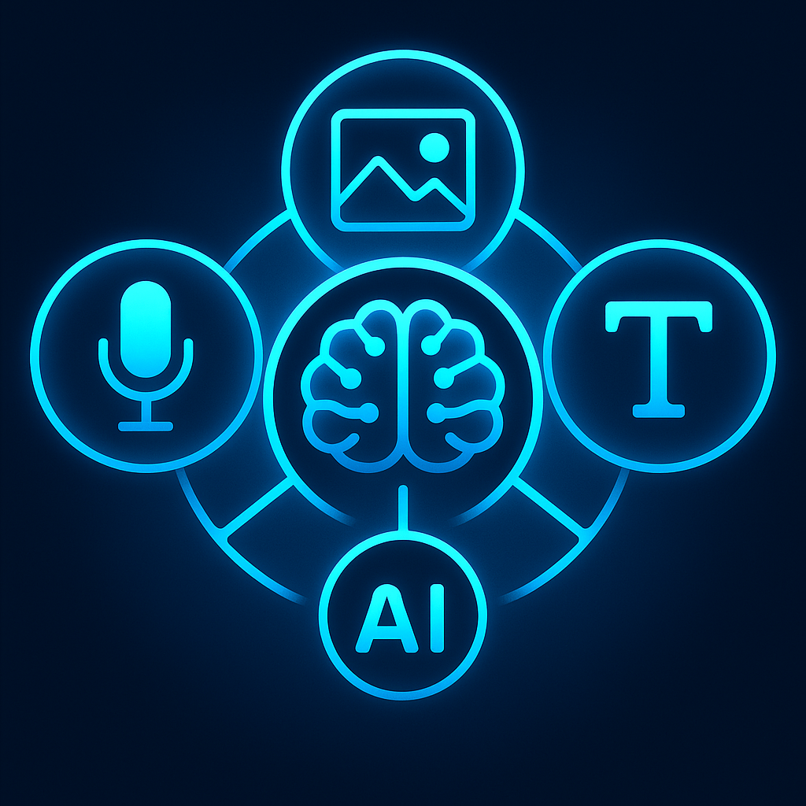
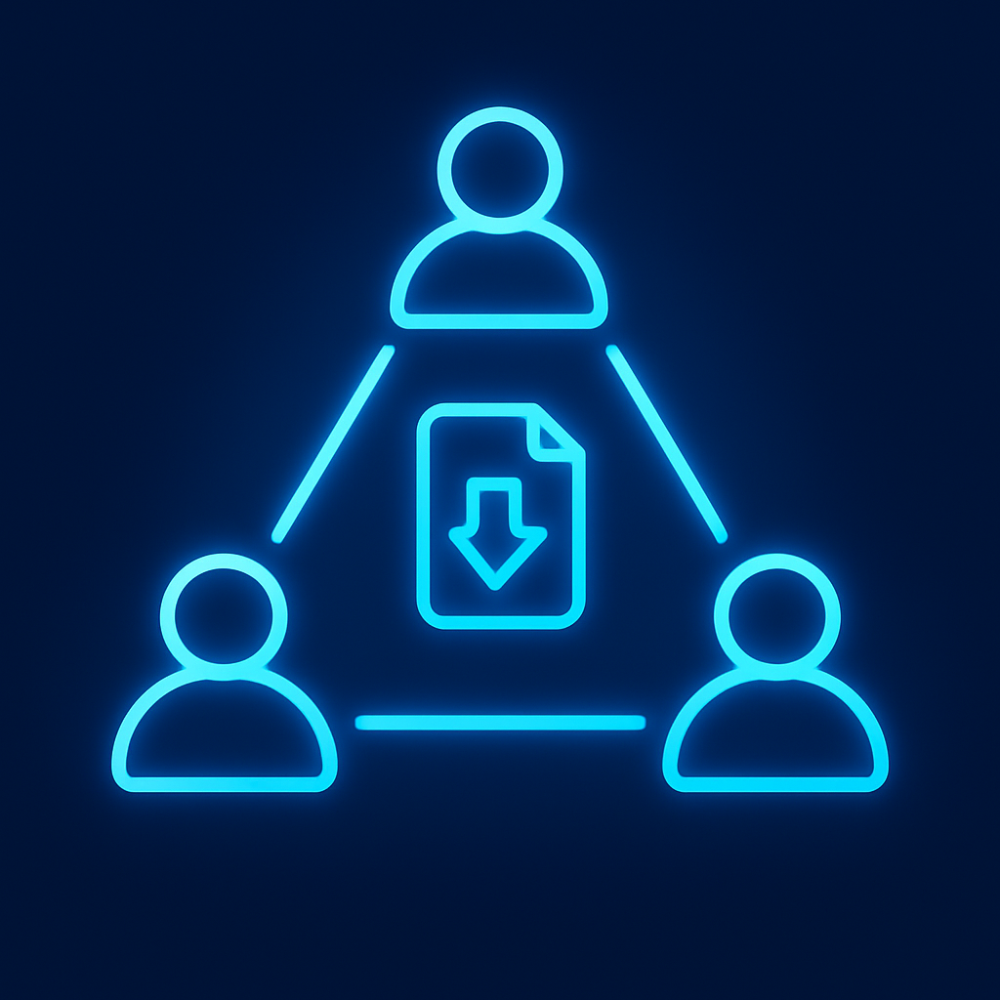
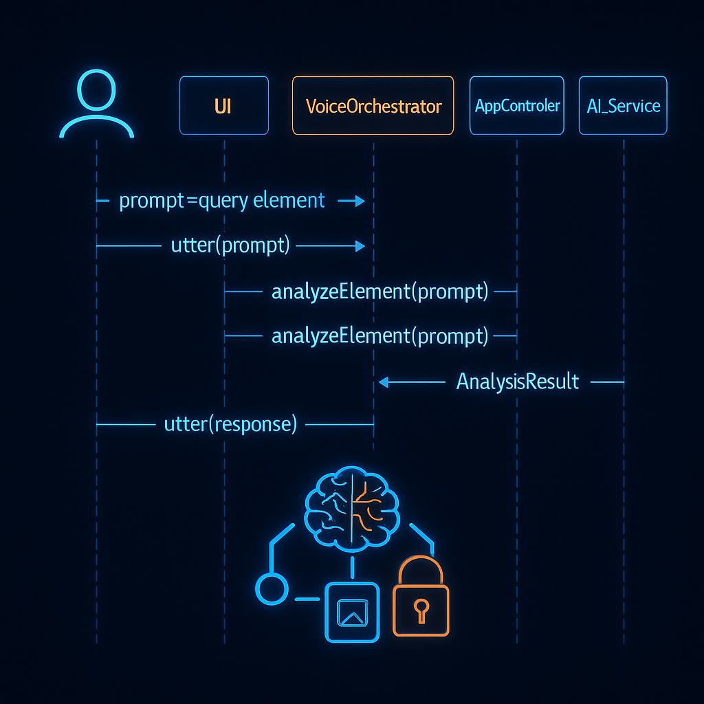
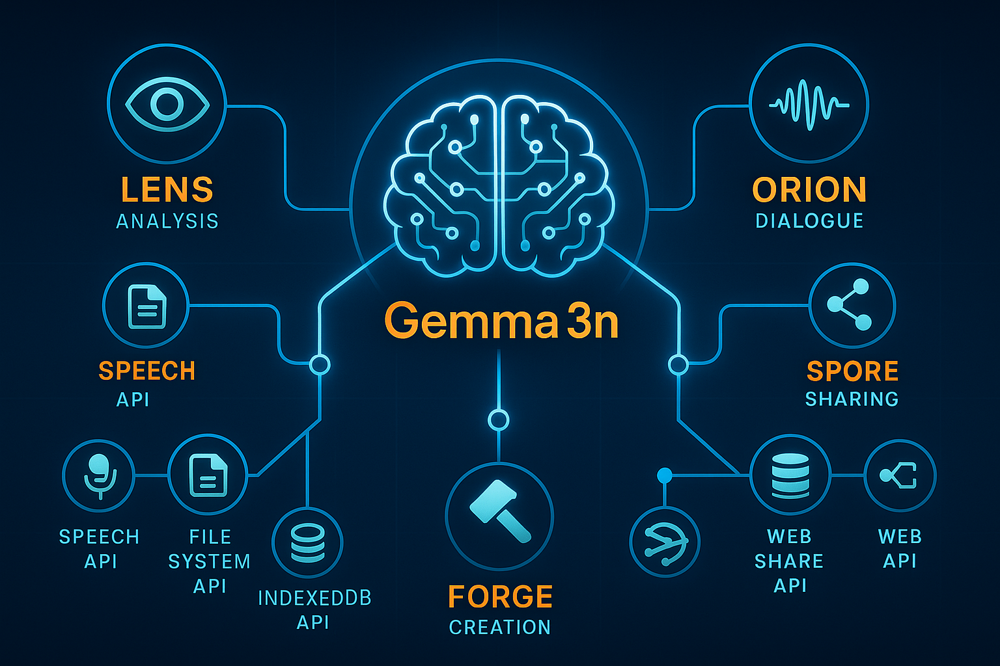
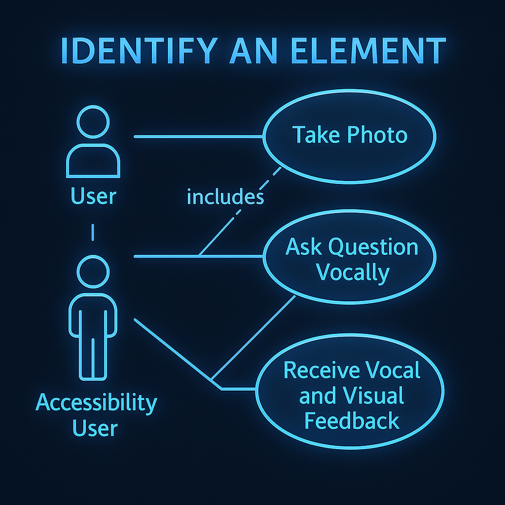

<!-- Titre et Badges : L'accroche professionnelle -->
# OpenBatra: Your On-Device Universal Identity Companion


<!-- Bannière Héroïque : L'image qui capture la vision -->
<p align="center">
  
</p>

<!-- Le Slogan : La vision en une phrase -->
**OpenBatra est une escouade d'agents IA, propulsée par Gemma 3n, qui tourne 100% en local dans votre navigateur pour créer, comprendre et partager l'identité numérique de n'importe quel bien, service ou concept, en toute confidentialité.**

---

<!-- Section 1 : Le "WOW FACTOR" (Priorité Absolue) -->
## 🚀 Démonstration

| Vidéo de Présentation (2m 45s) | Essayez la Démo Live |
| :---: | :---: |
| [](URL_DE_VOTRE_VIDEO_YOUTUBE) | [**> Lancer OpenBatra <**](URL_DE_VOTRE_DEMO_LIVE) |

---

<!-- Section 2 : La Vision (Cible le critère "Impact & Vision" - 40%) -->
## 🎯 Le Défi : L'Information Opaque

Le monde est rempli d'informations opaques. Qu'il s'agisse de comprendre la composition d'un produit, les clauses d'un service, les caractéristiques d'une œuvre d'art ou de cataloguer une espèce de plante, l'accès à une information claire et structurée est un défi constant.

<p align="center">
  
</p>

**Notre Solution :** Une "escouade agentique" universelle qui vit dans votre navigateur. Prenez une photo de *n'importe quoi*, dialoguez avec l'IA, et obtenez instantanément une fiche d'identité structurée, multilingue et partageable.

---

<!-- Section 3 : Les Piliers Techniques (Cible le critère "Profondeur Technique") -->
## ✨ Fonctionnalités Clés

| Feature | Description | Visual |
| :--- | :--- | :--- |
| 🧠 **100% On-Device** | L'analyse et la génération de données se font entièrement sur votre appareil grâce à Gemma 3n. |  |
| 🌐 **Offline-First** | Fonctionne parfaitement sans connexion internet, idéal pour les zones à faible connectivité ou la recherche sur le terrain. |  |
| 🗣️ **Multimodal** | Dialoguez naturellement avec l'IA en utilisant votre Voix, des Images et du Texte pour décrire et interroger n'importe quel sujet. |  |
| 🔗 **Décentralisé** | Génère des "Packs d'Identité" autonomes et des liens de partage via WebTorrent, sans serveur central. |  |

---

<!-- Section 4 : Comment ça Marche ? (La Preuve Technique en Profondeur) -->
## 🛠️ Architecture en Action

Notre force réside dans l'orchestration intelligente de Gemma 3n avec les APIs web modernes.

### Le Cœur de la Conversation : Diagramme de Séquence

Voici comment nos composants interagissent en quelques secondes pour répondre à une question sur un élément photographié :

<p align="center">
  
</p>

<details>
  <summary>Cliquez pour voir la description détaillée du flux d'interaction</summary>
  
  #### Description Détaillée du Flux
  
  1.  **[User → UI]** L'utilisateur prend une photo de l'élément à analyser (un objet, un texte, une scène...).
  2.  **[UI → VoiceOrchestrator]** L'UI demande au `VoiceOrchestrator` de poser la question de contexte à l'utilisateur via la **Web Speech API (SpeechSynthesis)**.
  3.  **[User → VoiceOrchestrator]** L'utilisateur pose sa question vocalement (ex: "Quelles sont les clauses de résiliation de ce contrat ?"). L'audio est transcrit en texte via **SpeechRecognition**.
  4.  **[VoiceOrchestrator → AppController]** Le texte de la question est transmis au contrôleur principal.
  5.  **[AppController → AI_Service]** Le contrôleur appelle le service IA avec l'image et la question.
  6.  **[AI_Service]** Le service exécute le prompt `analyzeElement` sur **Gemma 3n**. Le modèle effectue l'OCR si nécessaire, l'analyse contextuelle de l'image et du texte, et génère un objet JSON structuré.
  7.  **[AI_Service → AppController]** Le résultat JSON est retourné.
  8.  **[AppController → UI & VoiceOrchestrator]** Le contrôleur dispatche le résultat. L'UI met en évidence l'information pertinente sur l'image et le `VoiceOrchestrator` annonce la réponse vocale.

</details>

### L'Escouade Agentique : Rôles et Cas d'Utilisation

Notre architecture est modulaire, basée sur une "escouade" d'agents spécialisés.

<p align="center">
  
</p>

<details>
  <summary>Cliquez pour explorer les capacités de chaque agent et les cas d'utilisation UML</summary>
  
  - **Agent "Lens" (Analyse) :** Utilise Gemma 3n pour l'analyse multimodale (Texte + Image) et l'extraction d'entités.
    
    *Diagramme du Cas d'Utilisation "Analyser un Élément" :*
    
    

  - **Agent "Orion" (Dialogue) :** Gère la conversation TTS/STT via la **Web Speech API**.
  
  - **Agent "Forge" (Création) :** Construit le "Pack d'Identité" final (`.zip`) avec **JSZip**.
  
  - **Agent "Spore" (Partage) :** Crée le torrent et le magnet link à partir du pack généré, via **WebTorrent**.

</details>

### Le Cerveau de l'IA : Le Prompt Maître

Notre interaction principale est pilotée par un prompt multimodal qui contraint la sortie de Gemma 3n à un format JSON strict, garantissant la fiabilité.

<details>
  <summary>Cliquez pour voir notre prompt maître</summary>

  ```text
  You are an expert multimodal AI assistant named "Lens". Your task is to meticulously analyze the provided image and answer the user's question about any object, service or concept depicted.

  You MUST respond ONLY with a single, valid JSON object that strictly adheres to the following JSON Schema. Do not add any conversational text or explanations. 

  ### JSON Schema to Follow:
  {
    "$schema": "http://json-schema.org/draft-07/schema#",
    "title": "AnalysisResult",
    "type": "object",
    "properties": {
      "humanReadableAnswer": { "type": "string" },
      "foundTerm": { "type": "string" },
      "contextSnippet": { "type": "string" },
      "confidenceScore": { "type": "number", "minimum": 0, "maximum": 1 },
      "boundingBox": {
        "type": "object",
        "properties": { "x": { "type": "number" }, "y": { "type": "number" }, "width": { "type": "number" }, "height": { "type": "number" } },
        "required": ["x", "y", "width", "height"]
      }
    },
    "required": ["humanReadableAnswer", "foundTerm", "confidenceScore", "boundingBox"]
  }

  --- INPUT ---
  Image: {{image}}
  User's Question: {{user_question}}