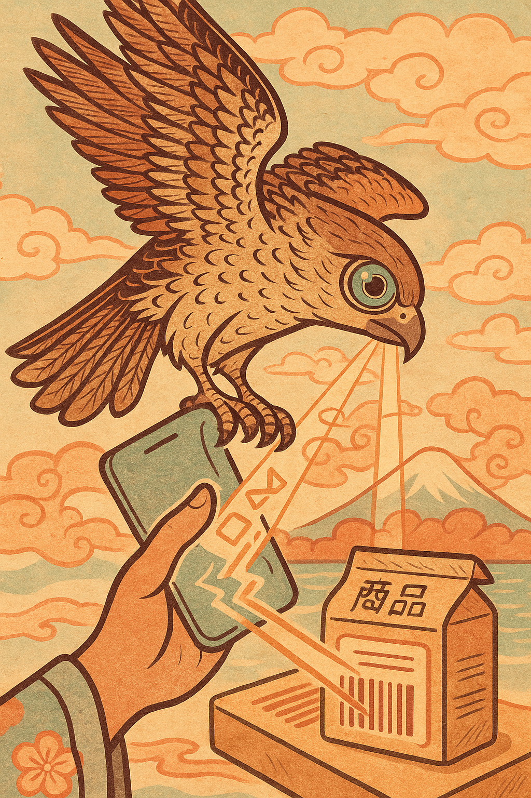
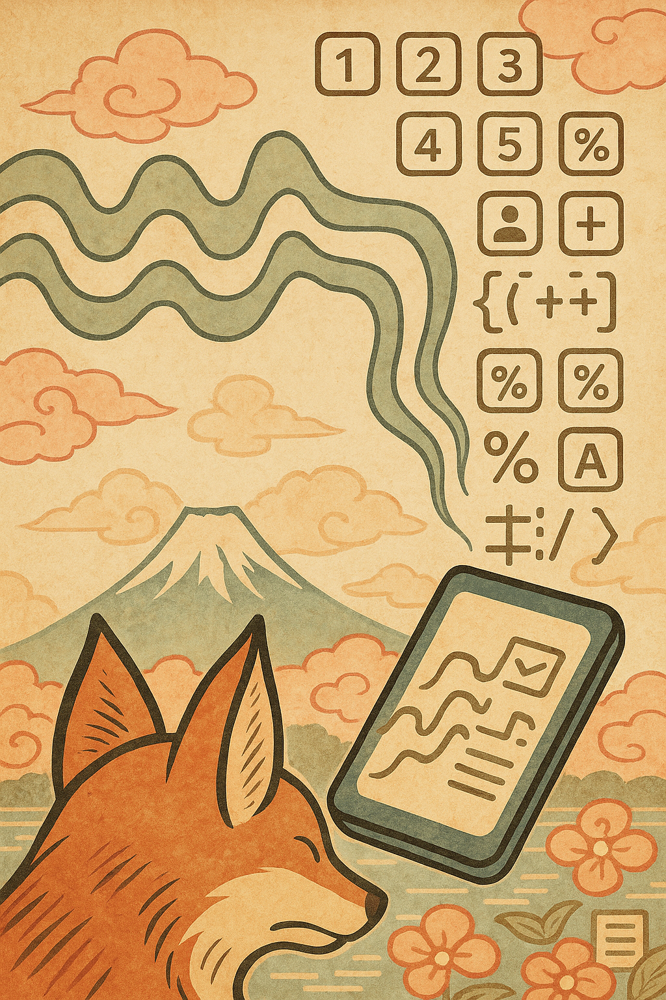
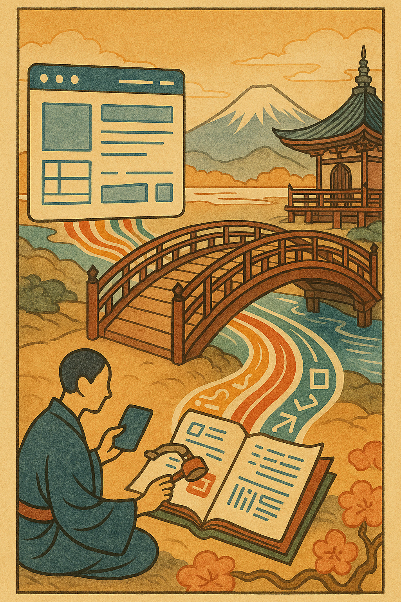

# **SchemaForge AI : Passeport Numérique On-Device**

## _Le Zen de la Saisie de Données Structurées : Quand l'Art Rencontre la Technologie et la Vie Privée_

**Défi Kaggle : Google - The Gemma 3n Impact Challenge**

---

### **Note sur les Illustrations : L'Art du Pixel, Soufflé par l'IA**

Chaque illustration présente dans ce document a été conçue pour capturer l'esprit de **SchemaForge AI** à travers le prisme de l'art traditionnel japonais (Ukiyo-e, estampes) avec des touches modernes et des couleurs chaleureuses. Le prompt utilisé pour générer chaque image via un outil d'intelligence artificielle est directement intégré dans l'attribut `alt` de l'image. Cela vous permet, si vous le souhaitez, de recréer ou d'adapter ces visuels. Aucune illustration ne contient de texte interne, toutes les informations textuelles sont dans le `alt` et la description du `README.md`.

---

---

### **1. Introduction : L'Éclat d'une Nouvelle Ère Numérique**

Dans un monde où l'information est reine, la standardisation et l'accessibilité des données sont des trésors inestimables. Cependant, la création de fiches d'identité numériques structurées (comme le JSON-LD Schema.org) reste un art arcanique, réservé aux initiés. **SchemaForge AI** brise ces barrières. Imaginez un compagnon IA, discret et toujours à portée de main, qui vous guide, par la voix et le regard, dans la création de passeports numériques pour tout objet, service ou organisation. Ces identités, d'une précision chirurgicale grâce à la puissance de Schema.org et de l'extension GS1 Vocabulary, se transforment en microsites web autonomes, partageables en un souffle, même loin des sentiers battus du réseau.

    
    
    

---

### **2. La Grande Vision : Un Kimono Numérique pour Chaque Entité**

Notre mission, tel un artisan d'estampes, est de tisser une tapisserie numérique où chaque produit, service ou organisation possède son identité propre, reconnaissable par tous. **SchemaForge AI** concrétise cette vision en offrant un outil on-device, privé et multimodal, capable de :

*   **Démocratiser la Saisie de Données Structurées :** Transformer un processus complexe en une conversation naturelle et guidée, accessible à tous.
*   **Promouvoir la Souveraineté Numérique :** Permettre la création et le partage d'informations vitales sans dépendance au cloud, garantissant confidentialité et autonomie.
*   **Renforcer l'Accessibilité et l'Inclusion :** Offrir une interface vocale intuitive, adaptée aux besoins de chacun.
*   **Innover dans le Partage d'Informations :** Utiliser le WebTorrent pour un échange P2P direct et résilient, idéal pour les zones à faible connectivité ou les situations d'urgence.
*   **Standardiser l'Identité Numérique :** Tirer parti de Schema.org et de GS1 Vocabulary pour garantir l'interopérabilité et la richesse des données.

    
    
    

---

### **3. Les Fonctionnalités Clés : Les Piliers du Temple Numérique**

*   **Création Guidée de Fiches d'Identité Schema.org :** Remplissage vocal et par options cliquables des propriétés `Product`, `Service`, `Organization`, enrichies par GS1 Vocabulary.
*   **Agents AI Multimodaux (Gemma 3n & ML Kit) :** Dialogue intelligent, reconnaissance visuelle (OCR, code-barres), détection de la langue.
*   **Base de Données Locale Schema.org & GS1 Vocabulary :** Connaissance approfondie et hors ligne de l'ontologie pour un guidage précis et une validation robuste.
*   **Génération de Microsites Statiques Multilingues :** Transformation de la fiche d'identité en une mini-page web autonome, traduite à la volée.
*   **Partage Décentralisé via WebTorrent :** Distribution facile et privée des microsites, même sans connexion internet stable.

    
    
    

---

### **4. L'Équipe d'Agents AI : Les Gardiens du Savoir Numérique**

Notre système d'IA est orchestré comme une équipe d'artisans experts, chacun apportant sa maîtrise pour sculpter la fiche d'identité parfaite.

#### **4.1. L'Agent "Chef d'Orchestre" (Gemma 3n) : Le Sage Narrateur**

Gemma 3n est le cœur de la conversation, le guide qui connaît chaque recoin de Schema.org et de GS1 Vocabulary (grâce à sa base de données locale). C'est lui qui pose les questions, interprète les réponses complexes de l'utilisateur (même vocales), et tisse la toile de la fiche JSON-LD.

*   **Raisonnement Conversationnel :** Maintient un dialogue naturel et cohérent, s'adaptant aux réponses de l'utilisateur.
*   **Guidage Schema-Informed :** Pose des questions spécifiques basées sur les propriétés requises, recommandées et optionnelles du schéma.org, en expliquant leur pertinence.
*   **Assemblage JSON-LD :** Intègre les informations recueillies dans la structure JSON-LD.
*   **Traduction Multilingue On-Device :** Utilise sa maîtrise des langues (Français, Japonais, Allemand, Coréen, Espagnol, etc.) pour traduire la fiche et le microsite sans dépendance au réseau.

#### **4.2. Les "Yeux Vifs" (ML Kit Vision - Scanners Intelligents) : Le Discernement du Regard**

Pour les informations qui se cachent dans le monde physique, nos "yeux vifs" entrent en scène, offrant une extraction rapide et précise, le tout on-device.

*   **Reconnaissance de Texte (OCR) :**
    *   **Utilisation :** Lorsque l'Agent Chef demande un nom de produit, une description, une adresse, un numéro de téléphone ou tout autre texte long. L'utilisateur peut choisir de "scanner une photo" d'une étiquette, d'un emballage, d'une carte de visite ou d'un document.
    *   **Bénéfice :** Réduit la saisie manuelle, améliore la précision, et valide la présence d'informations clés directement depuis la source.
*   **Lecture de Codes-Barres :**
    *   **Utilisation :** Pour capturer instantanément des identifiants uniques de produits (GTIN, UPC, EAN), essentiels pour la propriété `gtin` de Schema.org/GS1.
    *   **Bénéfice :** Saisie instantanée, sans erreur, des identifiants cruciaux.
*   **Détection d'Objets et Suivi (Potentiel) :**
    *   **Utilisation :** Pour aider à pré-catégoriser un produit ou valider que la photo correspond bien à l'objet attendu par le schéma.
    *   **Bénéfice :** Accélère la classification initiale, améliore la pertinence des questions de l'IA.

#### **4.3. Les "Oreilles Attentives" (ML Kit Natural Language - Compréhension Contextuelle) : L'Art de l'Écoute**

Pour s'assurer que le dialogue est toujours fluide et pertinent, nos "oreilles attentives" travaillent en coulisse pour affiner la compréhension du langage de l'utilisateur.

*   **Identification de la Langue :**
    *   **Utilisation :** Détecte automatiquement la langue parlée ou saisie par l'utilisateur.
    *   **Bénéfice :** Assure que Gemma 3n traite et génère du texte dans la langue correcte, essentielle pour les traductions.
*   **Extraction d'Entités (Bêta) :**
    *   **Utilisation :** Pour pré-traiter des phrases longues de l'utilisateur et en extraire des entités reconnues (personnes, lieux, organisations, dates, URLs) avant de les envoyer à Gemma 3n.
    *   **Bénéfice :** Aide Gemma à se concentrer sur le raisonnement et la structuration plutôt que sur la simple reconnaissance d'entités, améliorant ainsi l'efficacité et la pertinence de la réponse.

    
    
    

---

### **5. La Sagesse Ancestrale du Savoir : Schema.org & GS1 Vocabulary en DB Locale**

Le cœur battant de la précision de **SchemaForge AI** réside dans sa connaissance profonde et hors ligne de l'ontologie. Au premier démarrage, l'application charge l'intégralité des définitions de Schema.org et de l'extension GS1 Vocabulary dans une base de données locale (Room/SQLite).

*   **Schema.org :** Le vocabulaire universel pour décrire les entités web (produits, services, personnes, lieux, etc.).
*   **GS1 Vocabulary (`gs1Voc.txt`) :** Une extension cruciale de Schema.org, spécifiquement conçue pour l'industrie des biens de consommation, les chaînes d'approvisionnement et les identifiants uniques (GTIN pour les produits, GLN pour les lieux et organisations, etc.). Ce vocabulaire fournit des propriétés extrêmement détaillées sur :
    *   **Produits :** Allergènes, informations nutritionnelles, composition (textile, emballage), méthodes de préparation, allégations bio, garanties.
    *   **Organisations :** Types d'entités commerciales, rôles dans la chaîne d'approvisionnement, identifiants spécifiques à l'industrie (numéros d'enregistrement, SIRET, etc.).
    *   **Lieux :** Types de lieux (usines, entrepôts, points de vente), coordonnées géographiques précises, codes d'identification spécifiques.

#### **5.1. Structure de la Base de Données Locale : La Danse des Relations**

Pour garantir une exploration fluide et efficace du schéma par l'Agent Chef (Gemma 3n), la base de données locale est structurée comme suit :

*   **`SchemaClass` :**
    *   `iri` (TEXT, PK) : URI complète de la classe (ex: `https://schema.org/Product`, `https://ref.gs1.org/voc/AllergenDetails`).
    *   `name` (TEXT) : Nom court (ex: `Product`, `AllergenDetails`).
    *   `description` (TEXT) : Définition de la classe (comment `rdfs:comment` de `gs1Voc.txt`).
    *   `isDataType` (BOOLEAN) : `TRUE` si c'est un type primitif (Text, Number), `FALSE` si c'est une entité complexe. Utile pour différencier les comportements de l'IA.
    *   `sourceVocab` (TEXT) : Indique si c'est `schema.org` ou `gs1.org/voc`.
    *   `parentClasses` (TEXT) : Liste des IRIs des classes parentes (pour la navigation hiérarchique).

*   **`SchemaProperty` :**
    *   `iri` (TEXT, PK) : URI complète de la propriété (ex: `https://schema.org/name`, `https://ref.gs1.org/voc/gtin`).
    *   `name` (TEXT) : Nom court de la propriété (ex: `name`, `gtin`).
    *   `description` (TEXT) : Définition de la propriété (comment `rdfs:comment` de `gs1Voc.txt`).
    *   `isFunctional` (BOOLEAN) : Indique si la propriété ne peut avoir qu'une seule valeur (`owl:FunctionalProperty`).
    *   `sourceVocab` (TEXT) : Indique si c'est `schema.org` ou `gs1.org/voc`.

*   **`ClassPropertyMapping` :**
    *   `classIri` (TEXT, FK vers `SchemaClass.iri`) : La classe à laquelle la propriété s'applique.
    *   `propertyIri` (TEXT, FK vers `SchemaProperty.iri`) : La propriété.
    *   `orderIndex` (INTEGER) : L'ordre suggéré pour poser la question (peut être défini par défaut ou ajusté).
    *   `isRecommended` (BOOLEAN) : Pour prioriser les questions.
    *   `isOptional` (BOOLEAN) : Si la propriété n'est pas obligatoire.
    *   `uiPromptQuestionTemplate` (TEXT) : Le template de question à poser à l'utilisateur (ex: "Quel est le [nom_propriété] pour votre [type_objet] ?").
    *   `uiInputType` (TEXT) : Indique le type d'interaction UI attendu (ex: `text_input`, `number_input`, `url_input`, `boolean_radio`, `image_capture`, `barcode_scan`, `audio_input`, `nested_object_creation`, `enum_dropdown`).

*   **`PropertyExpectedRange` :**
    *   `propertyIri` (TEXT, FK vers `SchemaProperty.iri`)
    *   `expectedClassIri` (TEXT, FK vers `SchemaClass.iri`) : Le type de donnée ou de classe attendu pour cette propriété.

*   **`EnumerationValue` :** (Pour les listes de valeurs prédéfinies comme `gs1:AllergenTypeCode`, `gs1:PaymentMethod`)
    *   `enumTypeIri` (TEXT, FK vers `SchemaClass.iri` où `isDataType = FALSE`) : L'énumération parente (ex: `gs1:AllergenTypeCode`).
    *   `valueIri` (TEXT, PK) : L'URI de la valeur (ex: `gs1:AllergenTypeCode-MILK`).
    *   `name` (TEXT) : Le nom lisible (ex: `Milk and its derivatives`).
    *   `description` (TEXT) : Commentaire/définition.

#### **5.2. Processus de Chargement : La Cérémonie du Premier Démarrage**

Au tout premier lancement de **SchemaForge AI**, le fichier `gs1Voc.txt` (et une version simplifiée de Schema.org si non incluse dans `gs1Voc.txt`) sera parsé et inséré dans la base de données Room.

*   **Extraction des Données :** Un script (pré-généré ou exécuté on-device) parcourra les JSON-LD (`@graph`) pour identifier les classes (`owl:Class`, `rdfs:Class`), les propriétés (`rdf:Property`, `owl:ObjectProperty`, `owl:DatatypeProperty`) et leurs relations.
*   **Population de la DB :** Les informations pertinentes (`@id`, `rdfs:label`, `rdfs:comment`, `rdfs:domain`, `rdfs:range`, `owl:unionOf`, `skos:prefLabel`, `skos:exactMatch`, etc.) seront extraites et insérées dans les tables définies ci-dessus.
*   **Génération des Prompts UI :** Pour chaque propriété, `uiPromptQuestionTemplate` sera initialisé. Cela peut être générique (`"Quel est le [nom_propriété] ?"`) ou plus spécifique si les `rdfs:comment` le permettent. Ce sont ces templates qui seront utilisés par l'Agent Chef pour construire les questions vocales.

    
    
    

---

### **6. L'IHM Révolutionnaire : Le Dialogue Harmonieux**

L'interface de **SchemaForge AI**, nichée dans une `WebView` au sein d'un layout XML natif, est conçue pour une interaction quasi-exclusivement vocale, ponctuée de clics simples pour les choix fermés ou les déclencheurs d'action ML Kit.

#### **6.1. Le Dialogue Vocal Guidé par le Schéma :**

*   **Début :** L'utilisateur choisit le type d'objet à décrire (`Product`, `Service`, `Organization`) par la voix ou par un clic sur la `WebView`.
*   **Parcours Intelligent :** L'Agent Chef (Gemma 3n, via `SchemaFillingAgent.kt`) interroge la DB locale pour la prochaine propriété à remplir pour le schéma choisi.
    *   **Questionnement :** Il lit `uiPromptQuestionTemplate` depuis la DB et le transmet au `JSInterface` pour que la `WebView` vocalise la question à l'utilisateur.
    *   **Réponse Utilisateur :** L'API `SpeechRecognizer` de ML Kit (initiée par `JSInterface.startVoiceRecognition()`) transcrit la réponse vocale de l'utilisateur.
    *   **Traitement par Gemma 3n :** La transcription textuelle est envoyée à Gemma 3n (via `GemmaModelManager`) avec un prompt ciblé qui inclut la `description` de la propriété tirée de la DB. Gemma 3n extrait la valeur pertinente.
    *   **Validation & Boucle :** Kotlin valide la valeur extraite par Gemma 3n contre les `expectedClassId` et `uiInputType` de la DB. Si valide, la valeur est ajoutée au JSON. Si non, l'Agent Chef demande des clarifications ou des formats spécifiques.

#### **6.2. Options et Déclencheurs ML Kit (Clics Simples) :**

Pour les propriétés qui se prêtent à l'extraction automatique ou qui sont des choix fermés, la `WebView` présente des options cliquables :

*   **Exemple "Nom du Produit" :**
    *   **Agent Chef :** "Quel est le nom de votre produit ?" (`SchemaProperty: name`, `uiInputType: text_input`)
    *   **`WebView` (boutons) :** "Parler", "Taper", "Scanner l'étiquette (OCR)".
    *   Si "Scanner l'étiquette", `JSInterface.startOcrScan()` est appelé, ML Kit OCR extrait le texte, et le résultat est renvoyé via `JSInterface.onOcrResult()` à Kotlin.

*   **Exemple "Code-barres" (`gtin`) :**
    *   **Agent Chef :** "Votre produit a-t-il un identifiant unique comme un code-barres (GTIN, UPC, EAN) ?" (`SchemaProperty: gtin`, `uiInputType: barcode_scan`)
    *   **`WebView` (boutons) :** "Oui, scanner le code-barres", "Non, je le dicte", "Non, je le tape".
    *   Si "Oui, scanner le code-barres", `JSInterface.startBarcodeScan()` est appelé, ML Kit Barcode Scanner extrait le code, et le résultat est renvoyé via `JSInterface.onBarcodeResult()`.

*   **Exemple "Allergènes" (`gs1:AllergenTypeCode`) :**
    *   **Agent Chef :** "Contient-il des allergènes spécifiques ?" (`SchemaProperty: hasAllergen`, `uiInputType: enum_dropdown`)
    *   **`WebView` :** Affiche une liste déroulante ou des checkboxes avec les valeurs d'énumération de `gs1:AllergenTypeCode` (obtenues depuis la DB locale). L'utilisateur clique.

#### **6.3. Architecture WebView / JSInterface / Kotlin (Un Pont entre Deux Mondes) :**

*   **`MainActivity.kt` (XML Layout) :** Contient la `WebView` principale et des `Views` superposées/masquées pour les fonctionnalités caméra/scanner de ML Kit.
*   **`assets/index.html` & `assets/app.js` :**
    *   L'UI web interprète les appels `JSInterface` de Kotlin pour afficher les questions, les invites d'action (scanner, dicter), et les options cliquables.
    *   Les interactions de l'utilisateur (voix transcrite, clics sur les boutons) sont capturées par `app.js` et renvoyées à Kotlin via `JSInterface`.
*   **Kotlin Native (`SchemaFillingAgent`, `GemmaModelManager`, `MLKitProcessors`) :**
    *   Reçoit les commandes de la `WebView`.
    *   Exécute la logique métier : consultation de la DB Schema.org/GS1, appel à Gemma 3n pour le raisonnement, appel à ML Kit pour l'extraction de données brutes.
    *   Renvoie les résultats et les prochaines questions à la `WebView`.

    
    
    

---

### **7. Le Web 4.0 : Le Sceau de l'Origine Numérique**

Votre vision d'un Web 4.0 axé sur la traçabilité des données générées par l'IA est non seulement clairvoyante, mais elle est intrinsèquement liée à la mission de **SchemaForge AI**. Chaque fiche d'identité créée est un fragment de ce futur web, et notre application s'engage à encapsuler son histoire complète.

Pour chaque donnée significative générée ou extraite par l'IA, **SchemaForge AI** crée un **"Document de Provenance IA"** au format JSON. Ce document, un véritable acte de naissance numérique, accompagne la fiche d'identité et garantit sa transparence totale.

#### **7.1. Contenu du Document de Provenance IA : Les Annales de la Création**

Chaque Document de Provenance IA incluera :

*   **Identifiant Unique de la Fiche :** L'ID de l'entité Schema.org générée.
*   **Version de SchemaForge AI :** Le numéro de version de l'application qui a généré la fiche.
*   **Identifiant du Modèle AI (Gemma 3n) :** Version exacte du modèle Gemma 3n utilisée (ex: "Gemma 3n 5B", "Gemma 3n 8B"), incluant la version de l'implémentation MediaPipe.
*   **Inputs Bruts :**
    *   **Textes :** Transcriptions brutes de la reconnaissance vocale de l'utilisateur.
    *   **Images :** Références aux images originales capturées (chemins locaux) et/ou leurs empreintes cryptographiques (hashes) pour vérification.
    *   **Audio :** Références aux clips audio originaux (chemins locaux) et/ou leurs hashes.
*   **Prompt(s) Utilisé(s) pour Gemma 3n :** L'intégralité des prompts textuels envoyés à Gemma 3n pour chaque étape de l'inférence. Cela inclura les propriétés Schema.org/GS1 pertinentes extraites de la DB locale et insérées dans le prompt.
*   **Résultat Brut de l'Inférence AI :** La sortie JSON-LD exacte et non traitée fournie par Gemma 3n pour chaque propriété ou bloc de génération.
*   **Délégations ML Kit :** Pour chaque information extraite par ML Kit (OCR, Barcode, Language ID) :
    *   Quel module ML Kit a été utilisé (ex: "ML Kit Text Recognition v2", "ML Kit Barcode Scanning").
    *   Quel était l'input pour ML Kit (ex: "image 'photo_produit_1.jpg'").
    *   Quel était le résultat brut de ML Kit (ex: "Texte OCR: 'SuperSavon Lavande 250g Bio'").
    *   La version du SDK ML Kit utilisée.
*   **Métadonnées de Génération :** Horodatage de la création, type de périphérique, version du système d'exploitation Android.
*   **Actions Utilisateur :** Les choix de l'utilisateur lors des questions fermées (ex: "Utilisateur a cliqué sur 'Analyser Photo' pour la propriété 'description'").

#### **7.2. Stockage et Partage du Sceau de l'Origine : La Diffusion du Savoir**

Ce Document de Provenance IA sera :

*   **Stocké Localement :** Pour chaque fiche d'identité générée, un fichier JSON distinct (ex: `product_ID_provenance.json`) sera sauvegardé dans le répertoire du microsite.
*   **Inclus dans le Microsite :** Un lien discret (ou même un QR code) dans le microsite HTML permettra à quiconque accédant au microsite de visualiser ce document de provenance.
*   **Partagé via WebTorrent :** Lorsque l'utilisateur partage le microsite via WebTorrent, le Document de Provenance IA est automatiquement inclus dans le paquet de fichiers, garantissant que l'historique complet de la création reste lié à la donnée elle-même, même en P2P.

#### **7.3. Capacités d'Audit et de Ré-inférence : L'Héritage Révélé**

Grâce à ce Document de Provenance, **SchemaForge AI** ouvre la voie à des fonctionnalités avancées :

*   **Audit Complète :** À tout moment, l'utilisateur ou un tiers (avec accès aux fichiers) pourra vérifier l'origine de chaque information de la fiche, traçant chaque étape depuis l'input initial jusqu'à la sortie finale de l'IA.
*   **Ré-inférence Ciblée :** L'application pourrait offrir une option pour "ré-inférer" une fiche en utilisant le Document de Provenance. Cela permettrait de :
    *   Tester une nouvelle version de Gemma 3n sur d'anciennes données pour voir les améliorations.
    *   Re-générer une partie de la fiche avec des paramètres différents (via l'interface de "Prompt Lab" ou de "Config") tout en gardant une trace de l'original.

    
    
    

---

### **8. Alignement avec le Concours Kaggle : La Force du Dragon**

**SchemaForge AI** n'est pas seulement une application, c'est une démonstration vivante des principes clés du "Google - The Gemma 3n Impact Challenge" :

*   **Impact & Vision (40 points) :**
    *   **Problème Réel :** Résout la difficulté de créer des identités numériques structurées, essentielle pour le web sémantique et la découverte de données par les moteurs de recherche, les agrégateurs, etc.
    *   **Solution Tangible :** Offre un outil pratique pour les petites entreprises, artisans, associations, ou même les particuliers, souvent exclus par la complexité et le coût.
    *   **Inclusion :** Accélère la "numérisation" des entités hors ligne ou à ressources limitées.
    *   **Confidentialité & Autonomie :** La création et le partage on-device et P2P garantissent que l'utilisateur garde le contrôle total de ses données.

*   **Video Pitch & Storytelling (30 points) :**
    *   **Facteur "Wow" :** La démo vocale fluide, l'intégration des scans ML Kit, le partage instantané via WebTorrent, et la capacité à révéler l'histoire de la création de la donnée (le Document de Provenance) créeront une expérience utilisateur mémorable et visuellement impactante.
    *   **Narrative puissante :** Mettre en scène un artisan traditionnel qui "donne vie" à son produit sur le web sémantique sans effort technique, grâce à l'IA, et dont la transparence est garantie.

*   **Technical Depth & Execution (30 points) :**
    *   **Utilisation Innovative de Gemma 3n :** Gemma 3n est sollicitée pour son raisonnement conversationnel, sa compréhension multimodale (audio, texte, image pour la génération) et ses capacités multilingues pour la traduction, le tout en exploitant le `gs1Voc.txt` localement pour des prompts précis.
    *   **Synergie ML Kit :** Démontre une intégration intelligente de ML Kit (OCR, Barcode, Speech Recognition, etc.) pour déléguer les tâches d'extraction brute et libérer Gemma 3n pour le raisonnement de haut niveau, maximisant l'efficacité on-device.
    *   **Architecture Robuste :** L'utilisation de Room DB pour Schema.org/GS1, l'orchestration complexe via Kotlin, WebView et JSInterface, l'intégration d'une solution de partage P2P (WebTorrent), et la mise en œuvre du "Document de Provenance IA" témoignent d'une ingénierie de pointe et d'une compréhension profonde de l'écosystème Android et des enjeux de l'IA.
    *   **Google AI Edge Prize :** L'implémentation repose entièrement sur le traitement *on-device* via MediaPipe pour Gemma 3n et les API de ML Kit, répondant directement aux critères de ce prix spécial.

---

### **9. Perspectives Futures : L'Horizon Se Dévoile**

**SchemaForge AI** est une graine prometteuse pour l'avenir des identités numériques autonomes. Les évolutions possibles incluent :

*   **Validation des Données en Temps Réel :** Utilisation plus poussée de ML Kit pour valider la conformité des données saisies (ex: détection de format d'adresse, de numéro de téléphone).
*   **Recommandation de Propriétés Intelligente :** L'Agent Chef (Gemma 3n), pourrait suggérer vocalement des propriétés Schema.org/GS1 `isRecommended` ou pertinentes en fonction du contexte de la description déjà fournie, voire de l'analyse d'images via ML Kit.
*   **Édition Visuelle de Fiches (Mode "Peintre Numérique") :** Permettre à l'utilisateur de cliquer sur une partie de l'image du produit (visualisée sur la WebView) pour que l'IA identifie et suggère les propriétés associées (ex: "Vous pointez le logo. Voulez-vous remplir la propriété `brand` ?").
*   **Génération de Types Complexes Avancés :** Étendre la capacité de l'IA à guider la création de propriétés complexes Schema.org imbriquées (ex: `address` -> `streetAddress`, `postalCode`, `addressLocality`...).
*   **Intégration d'Identifiants Uniques Avancés :** Permettre à l'IA de suggérer des formats d'identifiants uniques (GLN pour les organisations, etc.) en fonction du contexte et de valider leur format via ML Kit.

    
    
    

---

### **Conclusion : Un Voyage vers le Futur Numérique**

Avec **SchemaForge AI**, nous ne construisons pas seulement une application ; nous forgeons un outil puissant pour l'autonomisation numérique, rendant la création et le partage de données structurées accessibles à la voix et au clic. C'est une symphonie technologique où la puissance on-device de Gemma 3n et ML Kit, la sagesse des standards Schema.org/GS1 et la liberté du WebTorrent, se rencontrent dans un écrin d'artisanat Android, le tout avec la transparence essentielle du Web 4.0.